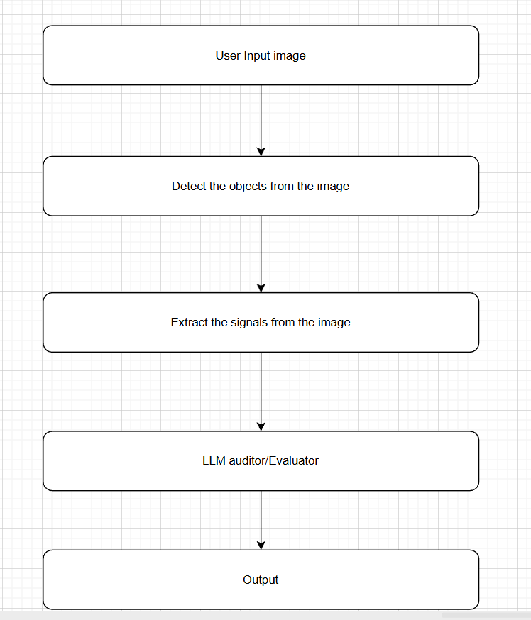

# Artikate Assignmet

This is a github repo consisting of the all the project files necessary to the assignment for ML engineer role at artikate. The entire project is contributed by Siva Sai Prasad Tirumanagiri. If you want to contribute to this project kindly send an email to sivasaiprasadtirumanagiri@gmail.com

## Project Title: E-Commerce Quality Auditor.

## Setup Instructions:

- `pip install -r requirements.txt`
- `ollama pull deepseek-r1:8b`

## How to Run:

- `streamlit run app.py --server.enableXsrfProtection=false`

## Architecture

  

## Signals Detected from the image

- Object detection/classification
- Object sharpness/Blurredness
- Image brightness
- Image aspect ratio

## Video link

